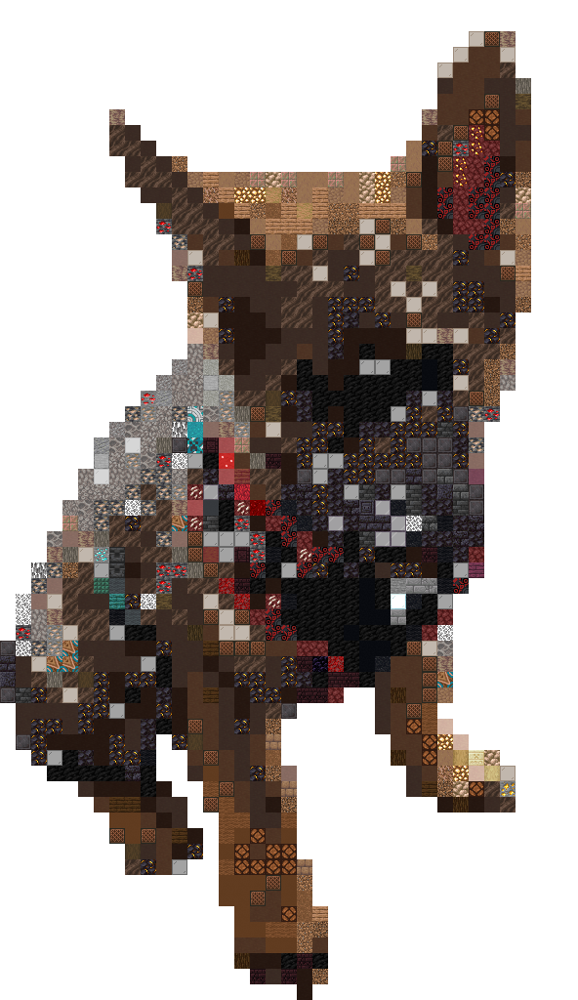

# mcpixel

make minecraft pixel art designs from an image.

### Example

<table>
	<tr>
		<th>Before</th>
		<th>After</th>
	<tr>
		<td></td>
		<td></td>
	</tr>
</table>

### Upcoming features

- Schematic generation
- Output to different image formats
- Make list of resources and generate images to represent that
- WASM support
- Potentially make it look better on lower resolutions?
