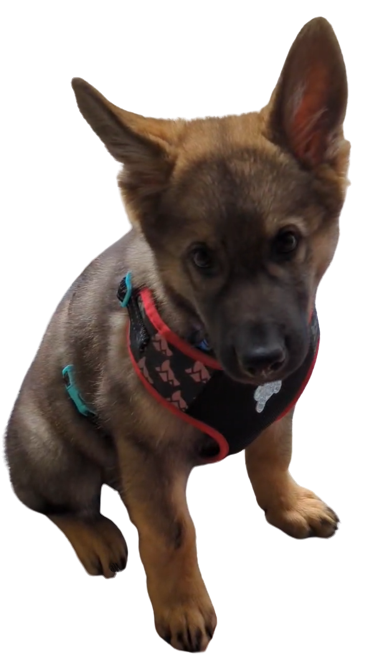

# mcpixel

make minecraft pixel art designs from an image.

### Example

<table>
	<tr>
		<th>Input</th>
		<th>Output (64 height)</th>
		<th>Output (build limit)</th>
	<tr>
		<td></td>
		<td></td>
		<td></td>
	</tr>
</table>

### Todo

- Generate graphical resource list
- WASM support
- Potentially make it look better on lower resolutions?
- Look into [PixelStacker](https://github.com/Pangamma/PixelStacker) - could I implement similar functionality because the results are GORGEOUS!
- proc macro to replace the build script and generate the enums/impls from info in a json document
- Add support for different versions of Minecraft
